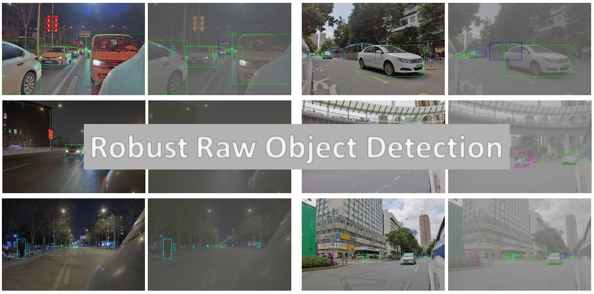

# Robust RAW Object Detection



## 0. Attention board
- As far as we know, leaderboard status cannot be changed once the challenge is launched. We cannot set leaderboard to public even as challenge hosts. Instead, **we will keep screenshots of leaderboard once a week [at this url](./figures/leaderboard/leaderboard.md)**.
- **Our baseline code now is available at [this repository](https://github.com/huawei-noah/noah-research/tree/master/RAOD)**.


## 1. Overview 

This repository provides some instructions for the [Robust RAW Object Detection](https://wvcl.vis.xyz/challenges) Challenge in [VCL Workshop @ ICCV 2023](https://wvcl.vis.xyz/). Here is the [challenge homepage](https://evalai.vis.xyz/web/challenges/challenge-page/8/overview) for submitting results and leader board.


Our dataset is available at **Dropbox**, **Baidu Cloud Disk**, and **OPENI**. Please see [this file](./ROD_Dataset/ROD_Dataset.md) for downloading urls.

## 2. Training phase
We provide training split of ROD Dataset at [this url](./ROD_Dataset/ROD_Dataset.md). The dataset will take up over 250 GB after unzipping. Please make sure you have enough disk space.

### 2.1 Loading Raw data
We provide sample codes for loading Raw images. It will return a ndarray of size 1856 $\times$ 2880 $\times$ 1, normalized to data range [0, 1].

```python
import numpy as np
BIT8, BIT16, BIT24 = 2 ** 8, 2 ** 16, 2 ** 24

def load_raw(name):
    assert name.endswith('.raw')

    raw = np.fromfile(name, dtype=np.uint8)
    raw = raw.reshape(1856, 2880, 3).astype(np.float32)
    raw = np.split(raw, 3, axis=2)
    raw = (raw[0] + raw[1] * BIT8 + raw[2] * BIT16)
    return raw / (BIT24 - 1)
```

### 2.2 Loading annotations
We provide sample codes for loading annotations.

```python
import json

def load_anno(name):
    assert name.endswith('.json')

    with open(name) as f: data = json.load(f)
    for obj in data['shapes']:
        klass = obj['label']
        xmin, ymin = obj['points'][0]
        xmax, ymax = obj['points'][1]
        assert 0 <= xmin < xmax <= 2880
        assert 0 <= ymin < ymax <= 1856

```

## 3. Validation phase
We provide validation split of ROD Dataset at [this url](./ROD_Dataset/ROD_Dataset.md). Participants should run detection results locally, and submit their results in `.zip` format on [challenge homepage](https://evalai.vis.xyz/web/challenges/challenge-page/8/overview). 

Please store your prediction in the following format:

```text
submission.zip                                      # Contains all the prediction files. Please name it as `submission.zip`.
    ├── file1.txt                                   # Detection results for file1. Detailed descriptions can be seen below.
        Cyclist 0.9985 2453 819 2550 1059\n
        Car 0.8765 2188 849 2487 1069\n
        Car 0.6276 2380 840 2588 1046\n
    ├── file2.txt                                   # Detection results for file2. 
        Pedestrian 0.9924 1822 719 1969 1187\n
        Pedestrian 0.9802 1256 796 1333 1024\n
    ├── ...
```

To be more specific:

- Save detection results in txt format, and keep txt's name the same as raw's name. For instance, detection results for `day-00001.raw` should be in `day-00001.txt`.
- Keep the txt file blank if no object is detected. That is, the number of `.txt` files in `submission.zip` is the same as `.raw` in valid split.
- In each txt, one line corresponds to one detected object. If `n` objects are detected from a `.raw` file, then the corresponding `.txt` has `n` lines.
- In each line, please follow this format: `class confidence bounding_box`, where `class` has capitalized first letter (same as annotations), and `confidence` is of type `float`. Use one single space as interval.
- Bounding box should be of `xyxy` format, type `int`, and with 1856 $\times$ 2880 coordinate (same as raw).

## 4. Testing phase
Testing dataset will not be released to participants, thus testing phase is a pure blind test. Participants should send a zip file to organizers, containing executable codes and well trained model weights. Codes should be runnable with the following command, and save detection results in subfolder `./results` (in `.txt` format, same as validation phase). We provide an example [here](./codes/example_start_eval.sh). (Optional: If any self-written libraries is used, please also including its compilation in the `start_eval.sh` script.)

```bash
bash start_eval.sh /home/datasets/ROD_Test/raws
```

Inputs will be of `.raw` format, thus if any pre-processing is applied in training or validation phase, please also include it in your testing project.

Our testing environment is a single 32G-memory GPU, with python 3.7.10 and CUDA 10.2. Please make sure the submitted codes are compatible with this environment. **Acceptable DL frameworks includes: PyTorch, TensorFlow and MindSpore.**

As a checklist, your submission for the final testing phase should a zipfile, with the following files:
- `start_eval.sh` script;
- Model weights (pth, ckpt, pb, etc.);
- Inference codes, which will generate detection results in `./results` folder in `.txt` format (same as validation phase);
- A visualization and a brief introduction of your model structure. PDF format recommended.

Please send your submission to **all of the following organizers**:
- pengjingyang1 AT huawei DOT com
- xurk AT mail DOT ustc DOT edu DOT cn

Notice that if your submission file is too large to be attached to an email, please send the downloading link of your submission to organizers. Google Drive / Dropbox / Baidu Cloud Disk is recommand. **Make sure that the last modified time is before Sept. 1st, 2023.**

## 5. License

- Baseline code: [Apache License 2.0](https://www.apache.org/licenses/LICENSE-2.0.html).
- Dataset: ROD Dataset follows [CC BY-NC 4.0 License](https://creativecommons.org/licenses/by-nc/4.0/). Commercial use is NOT ALLOWED.

## 6. Contact
Please contact Jingyang Peng for more details.  
Email: pengjingyang1 AT huawei DOT com
