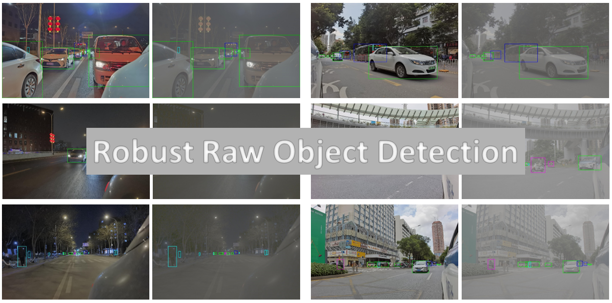

# Challenge C - Robust RAW Object Detection

## Goal
In this challenge, we aim to develop Raw Object Detectors that are robust to different scenes, i.g., lighting conditions. 

Traditional object detection methods take 8-bit sRGB images as inputs. However, sRGB images suffer from poor imaging quality, especially in extreme cases, e.g., low light conditions or scenes with strong bright / dark contrast. On the other hand, 24-bit RAW data, which is not degraded by any processor, contains more information than those sRGB conterparts. We believe such RAW images possibly lead to a better detection performance.

Making one step furthur, we want raw detectors that can handle both day and night scenes. Different lighting conditions, to some extent, are a powerful data augmentation. Detectors that are available for various lighting conditions is a key component of robustness.

Participants should get detection results for both day and night scene with a single model.

## Data usage

We provide ROD dataset for participants to develop their Raw Detectors. Additional training data is allowed.

- Training Phase:   
  [Training split](https://openi.pcl.ac.cn/innovation_contest/innov202305091731448/datasets?lang=en-US). Both RAW images and annotations are available in the same url.

- Validation Phase:  
  [Validation split](https://openi.pcl.ac.cn/innovation_contest/innov202305091731448/datasets?lang=en-US). Validation annotations will be released when the challenge is over.

- Testing Phase:  
  Testing data will NOT provided to participants. Participants should submit inference codes and also well-trained weights. Organizers will run the code and get the final ranking.

## Evaluation protocol
The participants will be evaluated on the test split of the ROD dataset. Evaluation metrics include AP50, AP75, mAP, and Rp95.
- For AP50, AP75 and mAP:  
  We follow [this](https://github.com/rafaelpadilla/Object-Detection-Metrics) github repository.  

- For Rp95:
  It is defined as the **highest** Recall when Precision is greater or equal to 0.95. IOU is set to be 0.5.

The final score will be the average of all four metrics.

## Computational resources

We recommend participants to have access to at least 4 GPUs for developing the models. It generally takes 3 days for training 300 epochs. The data will occupy around 250 GB of disk space. 

## Codes
A baseline implementation is coming soon! For more information, please refer to [this github repo](https://github.com/amumu1843/Robust_Raw_Object_Detection).